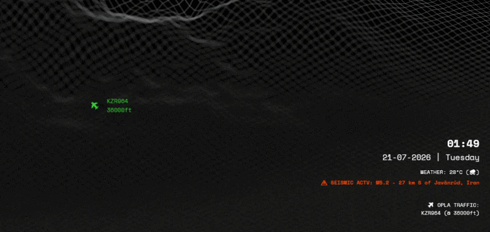

# DascHUD

  

> **Monitor the situation while you monitor the situation.**

DascHUD is a lightweight, transparent desktop Heads-Up Display (HUD) for Windows that provides **ambient situational awareness** while you work.

Instead of opening multiple websites or dashboards, DascHUD quietly overlays live information on your desktop so you can stay aware of what's happening around you without interrupting your workflow.

---

## Why?

It started as a simple clock.

I use my second monitor for designing, watching videos, and working, and I kept losing track of time because I didn't want the Windows taskbar occupying valuable screen space.

So I built a transparent clock.

Then I thought...

*"Since it's already there, why not show the weather?"*

That quickly became aircraft flying overhead.

Then emergency squawks.

Then disaster and seismic monitoring.

Then regional hydrology and flood thresholds.

Then overhead military and intelligence satellites. 

Then regional kinetic airspace closures.

Before I knew it, my little clock had evolved into an ambient situational awareness HUD.

---

## Features

- 🖥️ **Diagnostic Boot Sequence** (On-launch connectivity and API validation)
- 🕒 **Live Time, Date & Day**
- 🌤️ **Weather** (Emoji + Temperature)
- ✈️ **Live Aircraft Overlay** (Smooth animations using heading, speed, and altitude with upright labels)
- 🚨 **Emergency Squawk Monitoring** (7500 / 7600 / 7700 alerts)
- 🛰️ **Orbital Tracker** (Live overhead passes for Military, Government, SUPARCO, ISS, and Starlink)
- 📜 **Airspace & NOTAM Monitor** (Aggressive filtering for live-fire, weapon tests, and military exercises across designated Flight Information Regions)
- 🔥 **Proximity Thermal Monitor** (Strict 30km radius tracking for fires and thermal anomalies)
- 🌊 **Hydrology Monitor** (Tracks major dam/river discharge dynamically in native Cusecs against FFD thresholds)
- ⚠️ **Seismic Activity Monitor** (USGS earthquake and tsunami warnings)
- 🖥️ **Multi-Monitor Support**
- ⚙️ **Configurable** (Via `config.json` for alignments, FIR targets, and API keys)
- 🖱️ **Click-Through** (Lightweight, completely transparent overlay)

---

## Philosophy

DascHUD isn't trying to replace FlightRadar24, weather websites, or disaster dashboards.

Its goal is simple:

> Surface interesting information without demanding your attention.

Think of it as ambient information rather than an interactive dashboard.

---

## Screenshots

> *(Coming Soon)*

---

## Installation

1. Download the latest release.
2. Extract the files.
3. Launch `DascHUD.exe` once to generate the default `config.json` file.
4. Close the application.
5. Edit `config.json` and add your free API credentials (N2YO, NASA FIRMS, SkyLink RapidAPI).
6. Relaunch `DascHUD.exe`.

---

## Configuration

Configuration is handled entirely through `config.json`.

Available options include:

- User location (Latitude / Longitude / City Code)
- Monitor selection & HUD positioning
- Target NOTAM FIRs (e.g., `["OPRR", "OPKR", "VABF", "VIDF"]`)
- API credentials
- Polling intervals
- Display preferences (Text alignment, radar range in km)

---

## Roadmap

- [ ] Area of Interest (AOI) monitoring
- [ ] User-Defined Flood Monitoring Sites via config
- [ ] Linux version
- [ ] Additional situational awareness providers

---

## Built With

- C# / WPF / .NET
- **Airplanes.live** (Primary ADSB Source)
- **OpenSky Network** (Fallback)
- **ADSB.lol** (Emergency Squawks)
- **Open-Meteo** (Weather & River Discharge)
- **USGS** (Seismic Activity Monitor)
- **N2YO** (Orbital Propagation & Satellite Tracking)
- **NASA FIRMS** (Thermal Anomalies)
- **SkyLink API** (Airspace Restrictions & NOTAMs)

---

## Contributing

Bug reports, feature requests, and pull requests are always welcome.

If you have an idea that fits the philosophy of **ambient situational awareness**, feel free to open an Issue.

---

## License

MIT License

---

> **Nothing serious.**
>
> **Just monitoring the situation.**